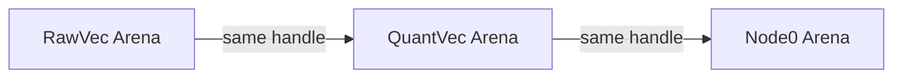

# Arena and Graph Design

## Arena Implementation

### Core Structure
```rust
pub struct Arena<T: DynAlloc + ?Sized, B> {
    chunks: Vec<Chunk<T>>,      // Memory chunks holding objects
    chunk_len: usize,           // Number of objects per chunk
    metadata: T::Metadata,      // Common metadata for all objects
    backend: B,                 // Memory management backend
}
```

This typed arena efficiently stores dynamically-sized objects with:
- Shared metadata for all objects
- Chunk-based allocation strategy
- Customizable memory backend
- Handle-based access

---

### DynAlloc Trait
```rust
pub trait DynAlloc {
    type Metadata: Clone + Copy;  // Shared object metadata
    type Args;                    // Per-object initialization data

    const ALIGN: usize;           // Required object alignment

    // Required methods
    fn size(metadata: Self::Metadata) -> usize;
    fn ptr_metadata(metadata: Self::Metadata) -> <Self as Pointee>::Metadata;
    unsafe fn new_at(ptr: *mut u8, metadata: Self::Metadata, args: Self::Args);
    
    // Provided method
    fn size_aligned(metadata: Self::Metadata) -> usize { ... }
}
```

**Key Responsibilities**:
- Defines object size and alignment
- Handles object initialization
- Manages DST (Dynamically Sized Type) metadata
- Ensures proper memory layout

---

### Core Functionality

#### Initialization
```rust
pub fn new(
    chunk_size: usize, 
    metadata: T::Metadata, 
    backend: B
) -> Self
```
- `chunk_size`: Objects per chunk (not bytes)
- `metadata`: Shared object metadata
- `backend`: Custom allocator

#### Object Allocation
```rust
pub fn alloc(&mut self, index: u32, args: T::Args) -> Handle<T>
```
- `index`: Monotonically increasing object index
- `args`: Object-specific initialization data
- Returns `Handle<T>` for object access

#### Object Access
```rust
impl<T: DynAlloc + ?Sized, B> Index<Handle<T>> for Arena<T, B> {
    type Output = T;
    
    fn index(&self, handle: Handle<T>) -> &T { ... }
}
```

#### Cleanup
```rust
pub fn clear(&mut self, len: u32)
```
- **MUST** be called before arena destruction
- Deallocates all memory chunks
- Drops objects in reverse allocation order

---

### Handle Abstraction
```rust
pub struct Handle<T: ?Sized> {
    index: u32,
    _marker: PhantomData<T>,
}
```
- Type-safe object reference (4 bytes)
- Supports casting between compatible types
- No pointer dereferencing overhead

---

### Backend System
```rust
pub trait ArenaBackend {
    unsafe fn alloc(&mut self, chunk_id: u32, layout: Layout) -> NonNull<u8>;
    unsafe fn dealloc(&mut self, ptr: NonNull<u8>, layout: Layout);
    fn flush(&mut self);
}
```

**Key Features**:
- Decouples memory management from arena logic
- Supports custom allocators (persistent, GPU, etc.)
- Default implementation uses global allocator

---

## Graph Implementation

### Handle Management System

**Bijective Arenas (1:1 Mapping)**:


- Identical handles across arenas reference the same logical entity
- Handle `X` in any arena = vector/node with ID `X`
- Enables efficient cross-referencing without indirection

**Node1 Arena (Separate Mapping)**:
```rust
struct Node1 {
    vec: VecHandle,  // Points to bijective handle
}
```
- Uses distinct handle space
- Contains vector handle from bijective set
- Stores nodes in ascending level order

### Hierarchical Node Structure

**Level Organization**:
```rust
pub struct Graph {
    // ...
    nodes1_arena: Arena<Node1>,  // Levels 1 to max_level
    nodes0_arena: Arena<Node0>,  // Level 0
}
```

**Node Types**:
```rust
struct Node0 {   // Base layer (level 0)
    neighbors: Neighbors  // High connectivity (m0)
}

struct Node1 {   // Navigation layers (1+)
    vec: VecHandle,      // Points to QuantVec
    neighbors: Neighbors  // Sparse connections (m)
}
```

**Level Traversal Rules**:
```rust
fn get_child(parent: Node1Handle, level: u8) -> Handle {
    if level == 1 {
        // Level 1: Direct vector reference
        self.nodes1_arena[parent].vec
    } else {
        // Levels 2+: Child = parent - 1
        Handle::new(*parent - 1)
    }
}
```

**Key Invariants**:
1. **Bijective Handle Consistency**:
   ```rust
   assert_eq!(*raw_handle, *quant_handle);
   assert_eq!(*raw_handle, *node0_handle);
   ```

2. **Node1 Level Ordering**:
   ```rust
   // Nodes stored consecutively by increasing level
   level_5_handle = Handle::new(100);
   level_4_handle = Handle::new(99);  // 100 - 1
   level_3_handle = Handle::new(98);  // 99 - 1
   ```

3. **Child Resolution**:
   ```rust
   // Valid for all levels ≥ 2
   child_handle = Handle::new(*parent_handle - 1)
   ```

### Advantages

1. **Pointer-Free Navigation**:
   - Handle arithmetic replaces pointer chasing
   - No memory indirection for level traversal

2. **Cache Efficiency**:
   - Sequential handle access patterns
   - Chunk-based memory allocation

3. **Serialization Friendly**:
   - Handles translate directly to file offsets
   - No pointer relocation needed

4. **Concurrency Safe**:
   - Handle-based access avoids dangling pointers
   - Atomic updates limited to neighbor lists

### Search Workflow
```rust
// Traverse from top level to base
let mut current = graph.top_level_root_node;
for level in (1..=graph.options.max_level).rev() {
    let results = graph.search_level1(current, query, ef, 1, true);
    current = if level == 1 {
        graph.nodes1_arena[results[0].node].vec.cast()
    } else {
        Handle::new(*results[0].node - 1)
    };
}

// Access base vector
let base_node = &graph.nodes0_arena[current];
let vector = &graph.raw_vec_arena[current];
```
